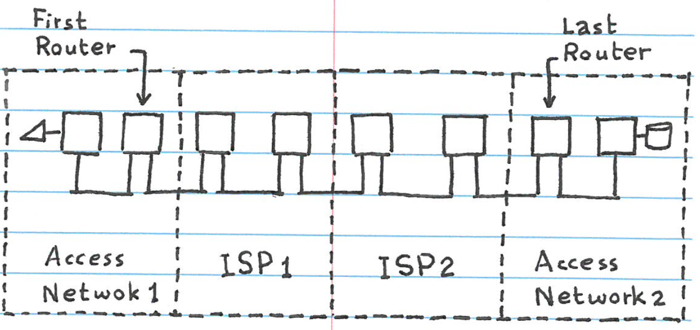
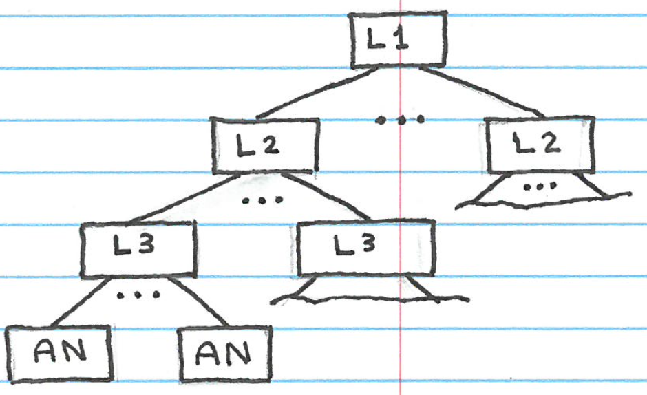

# Internet Service Providers (ISPs)

- To navigate a msg from a first router to a last router, the msg needs to go through a sequence of ISPs
- Each ISP is a set of inter-connected routers
- ISPs are organized in a tree of 3 levels

## ISP Tree

4 levels:

- L1: Tier 1 ISP
- L2: Regional ISPs
- L3: Local ISPs
- L4: Access Networks (ANs)

Lower levels (higher #) are **customers** to higher levels (lower #)

Higher levels (lower #) are **providers** to lower levels (higher #)

*Worst part of architecture from tiers: if one stops working, the ones below it go down*

**Solution:** Multiple copies of server boxes

Not perfect. There are multiple regional ISPs, and multiple Tier 1 ISPs

**multihoming**: an ISP in level `i` can be connected to 2+ ISPs on level `i-1`

**peering**: subnetwork connecting two routers in the same access network

**shortcut**: an access network or an ISP in Level 3 can be connected directly to a Tier 1 ISP

## Network Protocols
A network protocol specifies:

- *formats* of exchanged msgs
- *order* in which msgs are sent and received
- *actions* that need to be executed when a msg is sent or received